## 动态规划计算模型
* 从左往右尝试模型
* 范围尝试模型
* 样本对应模型
* 业务限制模型

##从左往右的尝试模型##
21-2 

### **汉诺塔问题**


```
#include<iostream>
using namespace std;
 
/*
5.代码实现的思路主要分为三步：
假设总共需要移动n个盘子
1.将A柱上的n-1个盘子借助C柱移向B柱
2.将A柱上仅剩的最后一个盘子移向C柱
3.将B柱上的n-1个盘子借助A柱移向C柱
*/

void process(int N, char A, char B, char C) {
	if (N == 1) {
		cout << A << "-->" << C << endl; //只剩最后一个盘子，直接从A移到C
	}
	else {
		process(N - 1, A, C, B); //将N上面的N-1个盘子，有A借助C移动到B
		cout << A << "-->" << C << endl;//将剩余的一个盘子从A移动到C
		process(N - 1, B, A, C);//将B里的N-1个盘子从 B借助A，移动到C
	}
}

int main() {
	process(3, 'A', 'B', 'C');
	return 0;
}
```
---

### 机器人走路问题

>给定四个参数N、P、M、K。表示：
N : 一共有1～N个位置
P : 一共有P步要走
M : 机器人初始停留在M位置上
K : 机器人想要去的位置是K
题目：已知，如果机器人来到 1 位置，那么下一步一定会走到 2 位置。如果机器人来到 N 位置，那么下一步一定会走到 N - 1 位置；如果机器人在中间的位置，那么下一步既可以走向左，也可以走向右。请返回，机器人如果初始停留在 M 位置，经过 P 步之后，机器人来到 K 位置的走法有多少种。
————————————————
版权声明：本文为CSDN博主「pcwl1206」的原创文章，遵循CC 4.0 BY-SA版权协议，转载请附上原文出处链接及本声明。
原文链接：https://blog.csdn.net/pcwl1206/article/details/97389894
---

```
#include<iostream>
using namespace std;

/*
给定四个参数N、P、M、K。表示：
N : 一共有1～N个位置
P : 一共有P步要走
M : 机器人初始停留在M位置上
K : 机器人想要去的位置是K
*/

int RobotWork(int N, int P, int M, int K) {
	if (P == 0) {  //只剩0步，看是否已经到目标位置，到了返回1，没到，返回0
		if (M == K) return 1;
		else return 0;
	}
	else {
		if (M == 1) {
			return RobotWork(N, P - 1, 2, K);
		}else
		if (M == N) {
			return RobotWork(N, P - 1, M - 1, K);
		}
		else {
			return RobotWork(N, P - 1, M - 1, K) + RobotWork(N, P - 1, M + 1, K);
		}
	}
}

int main() {
	cout << RobotWork(5, 4, 3, 5);
	return 0;
}
```


## 注意点
* 范围尝试模型特别注意讨论开头如何如何，和结尾如何如何，[i,j]之间，以及其之外的各种情况，如：最长公共自序列问题和最长回文自序问题


### 三
> 规定1和A对应，2和B对应，3和C对应，以此类推，例如字符串“111”就可以转化成“AAA”、“AK”和“KA”
给定一个只有数字字符组成的字符串str，返回多少种转化结果？

> 思路：
一、单个字符转化：从左到右不断尝试，如果i到了最右边（i==str.length），说明，前面都转化完了，则算作一种转化结果。
二、两个字符转化，如果两个字符符合转化规则，则将其进行双字符转化。
遇到0分两种情况，单个0算做无效字符，0+前面字符算双字符转化，

```
#include<iostream>
#include<vector>

using namespace std;

int process(vector<char> str, int i) {
	if (i == str.size()) {  //1111 位置0123 i到了最后4的位置，说明前面的字符都已经转化完了，此时算一种转化结果
		return 1;
	}
	if (str[i] == '0') {  // 中间遇到了0，有两种情况，一种是遇到单0，此时没有意义，返回0，第二种是加上前面的数字，变成10，此时转化成J，这种下面编写
		return 0;
	}
	int ways = process(str, i + 1);//str[i] 单个字符转化
	if (i + 1 < str.size() && ((str[i] - '0') * 10 + (str[i + 1] - '0')) <= 26) {
		ways += process(str, i + 2); //如果str[i]和str[i+1]满足26字母的十位转化，则加上这种转化方式
	}

	return ways;   //单字符和双字符的加起来就是总的转化方式

}

```


### 最长公共子序列

```
 问题分解：考虑 text1[0...i] 和 text2[0...j] 这两段，最长公共子序列是多长？
那么对应这个问题，一共有 4 种情况（考虑当前结尾存在哪些可能性）：
- 当前两个公共子序列，一定不以 i 和 j 结尾
- 一定以 i 结尾，一定不以 j 结尾
- 一定不以 i 结尾，一定以 j 结尾
- 一定同时以 i, j 结尾（有前提）
作者：pengyang233
链接：https://leetcode.cn/problems/qJnOS7/solution/cong-bao-li-di-gui-dao-dong-tai-gui-hua-4z2tu/
```


```
class Solution:
    def longestCommonSubsequence(self, text1: str, text2: str) -> int:
        return self.process(text1, text2, len(text1)-1, len(text2)-1)

    # text1[0 .. i]
    # text2[0 .. j]
    # 返回最长公共子序列
    def process(self, text1, text2, i, j):
	    # 有任何一个没了，都说明当前肯定没有公共子序列
        if i < 0 or j < 0:
            return 0
    
        # 公共子序列一定不以 i, j结尾
        p1= self.process(text1, text2, i-1, j-1)
        # 一定以 i结尾, 一定不以j结尾
        p2 = self.process(text1, text2, i, j-1)
        # 一定不以 i 结尾, 一定以 j 结尾
        p3 = self.process(text1, text2, i-1, j)
        # 一定以i, j 结尾(有前提条件，相等才行)
        p4 = 0
        if text1[i] == text2[j]:
            p4 = self.process(text1, text2, i-1, j-1) + 1

        return max(p1, p2, p3, p4)

```

* 自己的写法
```
#include<iostream>
#include<algorithm>
#include<string>
#include<vector>


using namespace std;


int process(string  str1, int index1, string str2, int index2,vector<vector<int>> db) {

    if (index2 < 0 || index1 < 0) {
        return 0;
    }

    if (db[index1][index2] != -1) {
        return db[index1][index2];
    }

    if (str1[index1] == str2[index2]) {
        db[index1][index2] = process(str1, index1 - 1, str2, index2 - 1,db) + 1;
        return db[index1][index2];
    }
    else {
        int p1 = process(str1, index1, str2, index2 - 1,db);
        int p2 = process(str1, index1 - 1, str2, index2,db);
        int p3 = process(str1, index1 - 1, str2, index2 - 1,db);
        db[index1][index2] = max(max(p1, p2), p3);
        return db[index1][index2];
    }
}
 int longestCommonSubsequence(string text1, string text2) {
     int t1 = text1.length() + 1;
     int t2 = text2.length() + 1;
     vector<vector<int>> db(t1, vector<int>(t2, -1));


	return process(text1, text1.length() - 1, text2, text2.length() - 1,db);
}
// text1 = "abcde", text2 = "ace"

int main() {
	string str1 = "abcde";
	string str2 = "ace";
	int t1 = (int)str1.length() - 1;
	int t2 = (int)str2.length() - 1;
	cout << longestCommonSubsequence(str1, str2);
	return 0;
}
```

### 下象棋
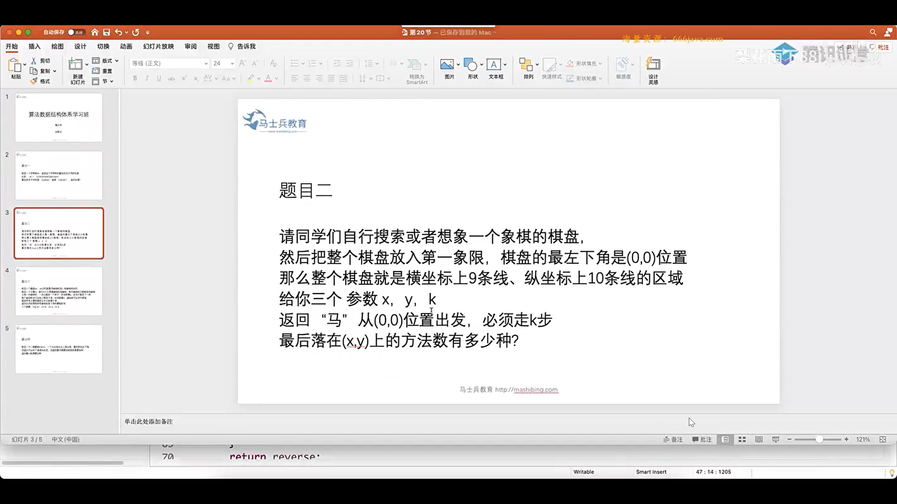
> 思路：暴力递归，让棋子自行去跳，只要规定好棋子的范围，以及最后的有效位置，最终就能得到相应的答案。
> basecase:当rest=0时，棋子现在的位置(x,y)刚好在预定的位置(a,b)上，
> 暴力路径：棋子有八种前进方式，分别进行这八种方式的递归，并且进行相加，最后得到的总数和就是所要的总路径方式。

```
#include<iostream>
#include<algorithm>
#include<string>
#include<vector>

using namespace std;

/*
当前来到的位置是（x，y）
还剩下rest步需要跳
返回跳完rest步到（a，b）的方法数
棋盘大小10*9
*/

int process(int x,int y,int rest,int a,int b) {
	if (x < 0 || x>9 || y < 0 || y>8) return 0;
	if (rest == 0) {
		return x == a && y == b ? 1 : 0;
	}
	int p1 = process(x - 1, y + 2, rest - 1, a, b);
	p1 += process(x + 1, y + 2, rest - 1, a, b);
	p1 += process(x + 2, y + 1, rest - 1, a, b);
	p1 += process(x + 2, y - 1, rest - 1, a, b);
	p1 += process(x + 1, y - 2, rest - 1, a, b);
	p1 += process(x - 1, y - 2, rest - 1, a, b);
	p1 += process(x - 2, y - 1, rest - 1, a, b);
	p1 += process(x - 2, y + 1, rest - 1, a, b);
	return p1;
}

int jump(int a, int b, int rest) {
	return process(0, 0, rest, a, b);
}

int main() {

	int x = 7, y = 7;
	int step = 10;
	cout << jump(x, y, step);
	return 0;
}
```

  

### 21-1

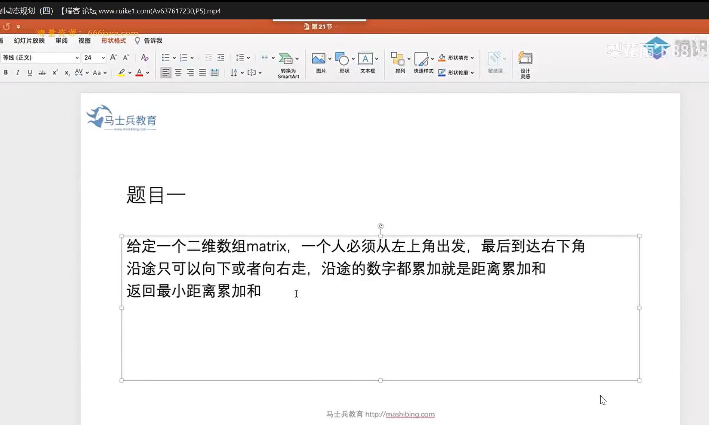


```
#include<iostream>
#include<vector>
using namespace std;

/*
arr[i][j]表示从matrix[0][0]走到右下角matrix[N-1][N-1]过程中每一步的最小距离累加和
比如：
3 1 4 6 7
9 2 8 6 4
2 12 1 2 5
7 2 1 6 7
3 2 1 2 3

matrix[0][0]走到[0][1]的过程中距离最小的就是需要3+1=4步
到[1][1]就是需要3+1+2=6步
这样arr[N-1][N-1]就是最小距离累加和
*/

int process(vector<vector<int>> matrix) {
	int h = matrix.size();
	int l = matrix[0].size();
	vector<vector<int>> arr(h, vector<int>(l, -1));
	arr[0][0] = matrix[0][0];
	for (int i = 1; i < l; i++) {
		arr[0][i] = arr[0][i - 1] + matrix[0][i];
	}
	for (int j = 1; j < h; j++) {
		arr[j][0] = arr[j - 1][0] + matrix[j][0];
	}
	for (int i = 1; i < h; i++) {

		for (int j = 1; j < l; j++) {
			int t = arr[i - 1][j] < arr[i][j - 1] ? arr[i - 1][j] : arr[i][j - 1];
			arr[i][j] = matrix[i][j] + t;
		}
	}


	for (int i = 0; i < h; i++) {
		for (int j = 0; j < l; j++) {
			cout << arr[i][j] << " ";
		}
		cout << endl;
	}
	return arr[h-1][l-1];
}

int main() {
	vector<vector<int>> arr = { {3,1,4,6,7},{9,2,8,6,4},{2,12,1,2,5},{7,2,1,6,7},{3,2,1,2,3} };
	cout<< process(arr);
	return 0;
}

```

### 21-2

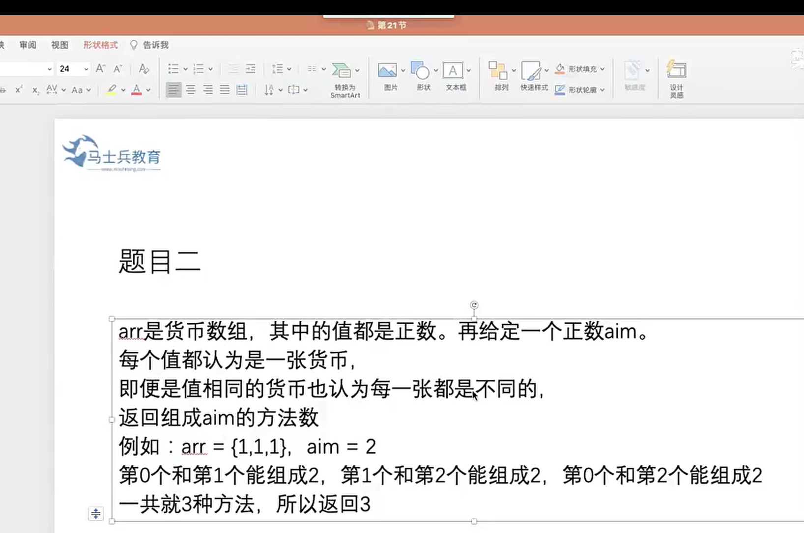

```
#include<iostream>
#include<vector>

using namespace std;

/*
暴力递归，每张货币取或不取两种选择，并让下标指向数组下一个
不取，index+1，把下标指向数组下一个，直至index==arr.size()
取，index+1，下标指向下一个，rest减去当前货币值，直至rest<0或index==arr.size()
取与不取，所有方式的和就是组成该aim的所有方法
*/

//arr[index...] 组成正好rest那么多钱，有几种方法
int process(vector<i nt> arr, int index, int rest) {
	if (rest < 0) return 0;
	if (index == arr.size()) {
		return rest == 0 ? 1 : 0;
	}
	else {
		return process(arr, index + 1, rest) + process(arr, index + 1, rest - arr[index]);
	}
}

int main() {
	vector<int> arr = { 1,1,1 };
	int aim = 2;
	cout << process(arr, 0, aim);

	return 0;
}
```

### 抢房子问题

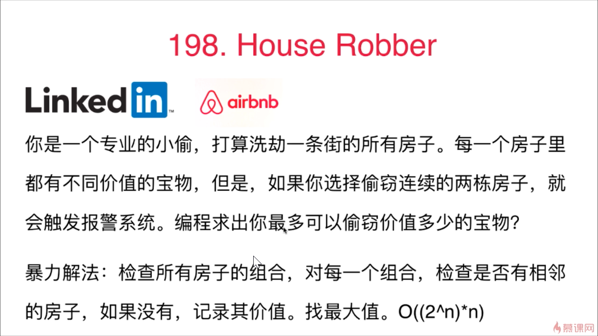

> 每个房子都有两种选择，一、选择抢当前房子，然后继续向index+2迭代，继续选择。二、不抢当前房子，那么就可以向n+1迭代。然后看这两种方式的最大值。最后输出的最大值就是要问题答案。      

```
#include<iostream>
#include<vector>
using namespace std;
// arr[] 代表每个房子的价值，index代表当前房子的下标
int process(vector<int> arr, int index) {
	if (index < 0 || index >= arr.size()) {   //下标范围限制
		return 0;
	}
	int p1 = arr[index] + process(arr, index + 2); //选择抢当前房子，并向index+2迭代
	int p2 = process(arr, index + 1);  //不抢当前房子，那么就向n+1迭代
	return p1 > p2 ? p1 : p2;   //取最大值
}

int main() {
	vector<int> arr = { 2,7,9,3,1};
	cout << process(arr, 0);
	return 0;
}
```


### 18-3

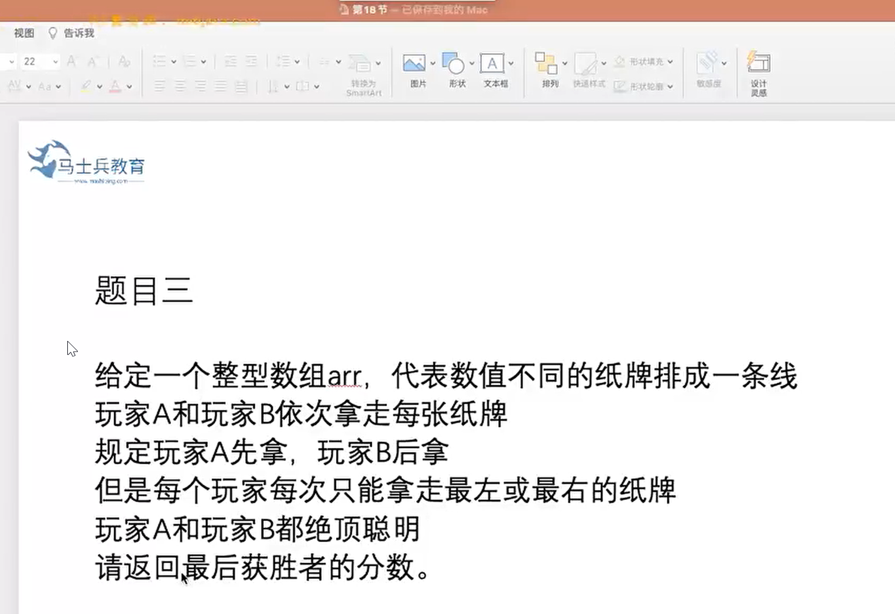

```
#include<iostream>
#include<algorithm>
#include<string>
#include<vector>


using namespace std;

int Previous(vector<int> arr, int L, int R);
int Black(vector<int> arr, int L, int R);

//表示arr[] L-->R 先手拿牌的话返回的最大值
int Previous(vector<int> arr, int L, int R) {  
	if (L == R) return arr[L];   //只剩一张牌，还是先手，故直接拿走
	int p1 = arr[L] + Black(arr, L + 1, R);  //第一种可能，先拿左边的牌，然后自己就变[L+1,R]的后手
	int p2 = arr[R] + Black(arr, L, R - 1);  //第二种可能，先拿右边的牌，然后自己变成[L,R-1]的后手
	int p3= max(p1, p2);           //取两种可能的最大值
	return max(p1, p2);
}

//表示arr[] L-->R 后手拿牌的话返回的最大值
int Black(vector<int> arr, int L, int R) {
	if (L == R) return 0;     //只剩一张牌，还是后手，那么牌只会被后手拿去，所以只能返回0
	int p1 = Previous(arr, L + 1, R);  //作为后手，[L,R]的牌已经被后手拿去，那么自己就是作为[L+1,R]的先手，尽努力拿此时作为先手的最大返回值
	int p2 = Previous(arr, L, R - 1);  ////作为后手，[L,R]的牌已经被后手拿去，那么自己就是作为[L,R-1]的先手，尽努力拿此时作为先手的最大返回值
	int p3 = min(p1, p2);  //后手，只能被迫拿最小值
	return min(p1, p2);
}


int process(vector<int> arr) {
	int L = arr.size();
	int first = Previous(arr, 0, L - 1);
	int black = Black(arr, 0, L - 1);
	return max(first, black);
} 


int main() {
	
	//vector<int> arr = { 5,7,4,5,8,1,6,0,3,4,6,1,7 };  //32
	vector<int> arr = { 1,100,1 };  //100
 	cout << process(arr);

	return 0;
}
```


### 20-1 背包问题

> 思路：暴力递归，每个物品都有拿或不拿两个选择，暴力枚举所有选项，再返回最大值。
> 但要注意一种可能：若有数组v[]={15}, w[]={10}, 但背包最大重量范围是 bag=8 时，此时若直接写 p1 = v[index] + process(v, w, index + 1, bag - w[index]); 那么p1就会获取v[index] = 15的值，然后向右递归，发现bag==-1，而返回，但此时p1已经获取了15的值（正常此值应该是无效），所以为了避免这种情况，应该在拿此物品前先判断拿该物品是否超出背包重量范围


```
#include<iostream>
#include<vector>

using namespace std;

//暴力递归，每个物品都有拿或不拿两个选择，暴力枚举所有选项，再返回最大值
int process(vector<int> v, vector<int> w, int index, int bag) {
	if (bag < 0 || index >= v.size() || index < 0) return 0; //范围限制，超过返回0，避免越界
	
	int p1 = 0;
	if (bag - w[index] >= 0) {    //防止物品重量超过背包限制，但还是因为p=v[index]+... 而返回了其价值（超过范围应该返回0）
		p1 = v[index] + process(v, w, index + 1, bag - w[index]); //没超过范围，取该物品，并向后面递归
	}
	int p2 = process(v, w, index + 1, bag);   //不取该物品，并向后面递归

	return max(p1, p2);  //返回两种选择的最大值
}


int main() {
	vector<int> v;
	vector<int> w;
	int N = 0, V = 0;
	cin >> N >> V;
	for (int i = 1; i <= N; i++) {
		int c, w1;
		cin >> c >> w1;
		v.push_back(c);
		w.push_back(w1);
	}
	cout<< process(v, w, 0, V);

	return 0;
}
```


### 23-2

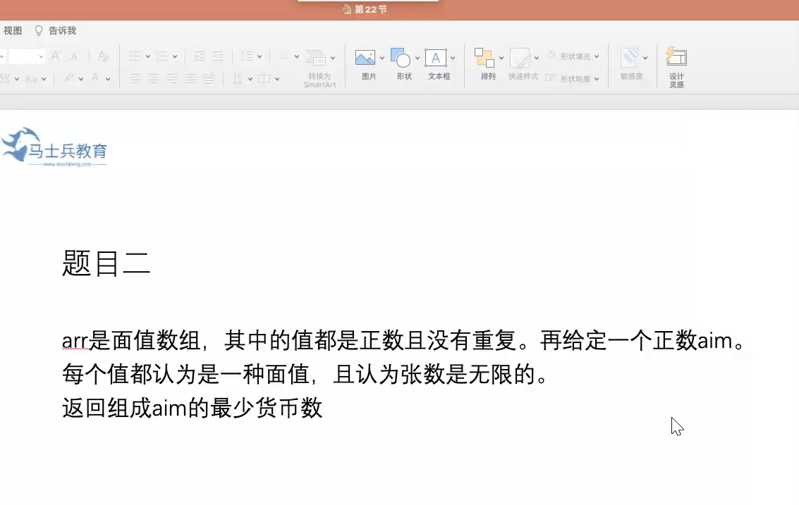

```
每张面值无限，那么就每张都给个机会，每张都不断去试，就有 (int zhang = 0; zhang * arr[index] <= rest; zhang++),假如有面值 50，20，10 组成100 ，那么就有递归层数
0 0 0 ，0 0 1 ，0 0 2 ，...
0 1 0 ，0 1 1 ，0 1 2 ，...
0 2 0 , 0 2 1 ，0 2 2 ，...

这样就能尝试所有的组合，最后得到需要最少张数的组合
```
```
#include <iostream>
#include<vector>
#include<string>
#include<map>
#include<cmath>
#include<algorithm>

using namespace std;

//返回 要正好组成rest那么多钱的最小张数
int process(vector<int> arr, int index, int rest) {
	if (rest < 0) {     //余下的钱小于0  返回一个系统最大值，表示无效值
		return INT_MAX;
	}
	if (index == arr.size()) {      //当index范围超出数组范围时，
		return rest == 0 ? 0 : INT_MAX;   //如果余下的钱为0，表示上一个递归正好把钱组好了，返回0就好（请看next+zhang），否则返回一个无效值
	}
	else {   //当index在范围内
		int ans = INT_MAX;         //先让ans=一个无效值
		for (int zhang = 0; zhang * arr[index] <= rest; zhang++) { //每张面值都给个机会，不断去试，一张一张的增加张数，只要张数*面值数 < 要组成的数就行
			int next = process(arr, index + 1, rest - zhang * arr[index]);  //index向后迭代，获取返回的最小张数
			if (next != INT_MAX) {   //如果返回next不是无效值
				ans = min(ans, next + zhang);
				/* 举个例子，有 50，20，10 三种面值，要组成100 。先是50的zhang=0，20的zhang=0，然后向10迭代递进，
				10就在 1张到10张间不断递进，最后当zhang=10时，process(arr,index+1,0)返回0，这时上一个递归的next就获取了0，而zhang==10，所以ans=0+10。
				0 0 ... 的递归完成后，此时50张数=0，20张数=0时，此时ans获取的值就是ans=10，此时20张数加一
				就到20的张数加1，然后继续向10递归，这时10面值的递归就是80的范围。
				毫无疑问，当20的张数=1时，next返回了8 （10面值时先返回0，然后0+8zhang返回给这层的next），此时ans=10，next=8 zhang=1，故ans更新为ans=8+1，
				以此类推。。。
				*/
			}
		}
		return ans;
	}
}

int main()
{
	vector<int> arr = { 50,20,10 };
	int rest = 100;
	cout << process(arr, 0, rest);

	return 0;
}


```


### 21-3

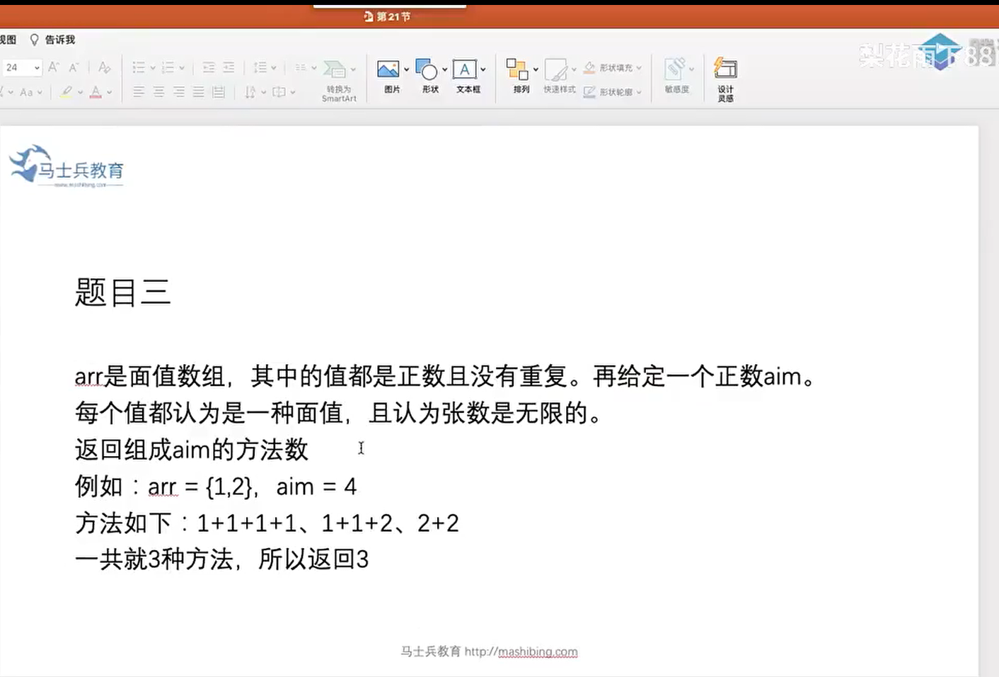

```
#include<iostream>
#include<vector>

using namespace std;

int process(vector<int> arr, int aim, int index) {
	if (index == arr.size()) {
		return aim == 0 ? 1 : 0;
	}
	int ways = 0;
	for (int i = 0; i * arr[index] <= aim; i++) {
		ways += process(arr, index + 1, aim - (i * arr[index]));
	}
	return ways;
}

int main() {

	return 0;
}
```


### 23-1

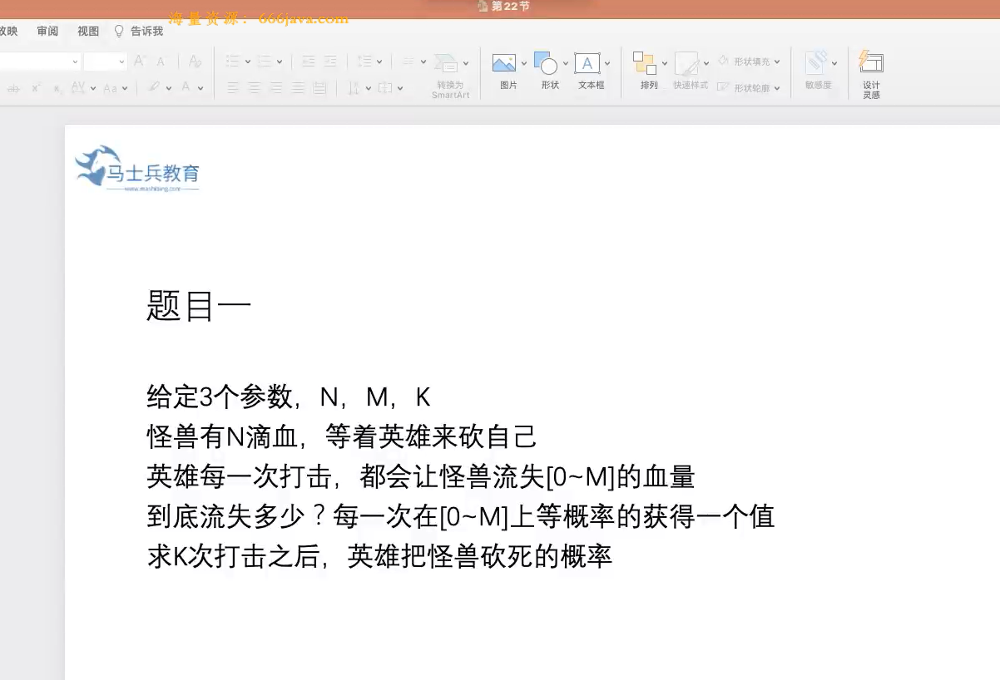

> 求概率，砍一刀，就会有0 ~ M 点血流失，共有M+1种情况，也就是说每砍一刀就有M+1种情况，那么经历K次打击之后，就会有（M+1）的K次方 可能，这是所有的情况数。那么砍死的概率就是  砍死的次数 / 所有的可能数   x/（M+1）的k次方

> 每砍一刀就会有 0~M 点血流失，那就把所有的情况都算一遍，死了就返回1

```
#include<iostream>
#include<vector>
#include<cmath>

using namespace std;

double right(int N, int M, int K) {
	if (N < 1 || M < 1 || K < 1) {
		return 0;
	}
	long all = (long)pow(M + 1, K); //砍完K刀的所有情况数
	long kill = process(N, M, K);   //杀死怪兽的次数
	return (double)((double)kill / (double)all); //概率
}

// 怪兽还剩N点血
//每次的伤害在[0~M]范围上
//还有K次可以砍
//返回砍死的情况数
long process(int N, int M, int K) {
	if (K == 0) {  //砍完K刀
		return N <= 0 ? 1 : 0; //还有血，返回0，没有返回1
	}
	long ways = 0;
	for (int i = 0; i <= M; i++) {  //每砍一刀掉0~M点血，那么把0~M的情况都给列出来，死了就一次成功
		ways += process(N - i, M, K - 1);
	}
	return ways;

}


int main() {

	return 0;
}
```

### 最长上升子序

>https://blog.csdn.net/Annabel_CM/article/details/110386961

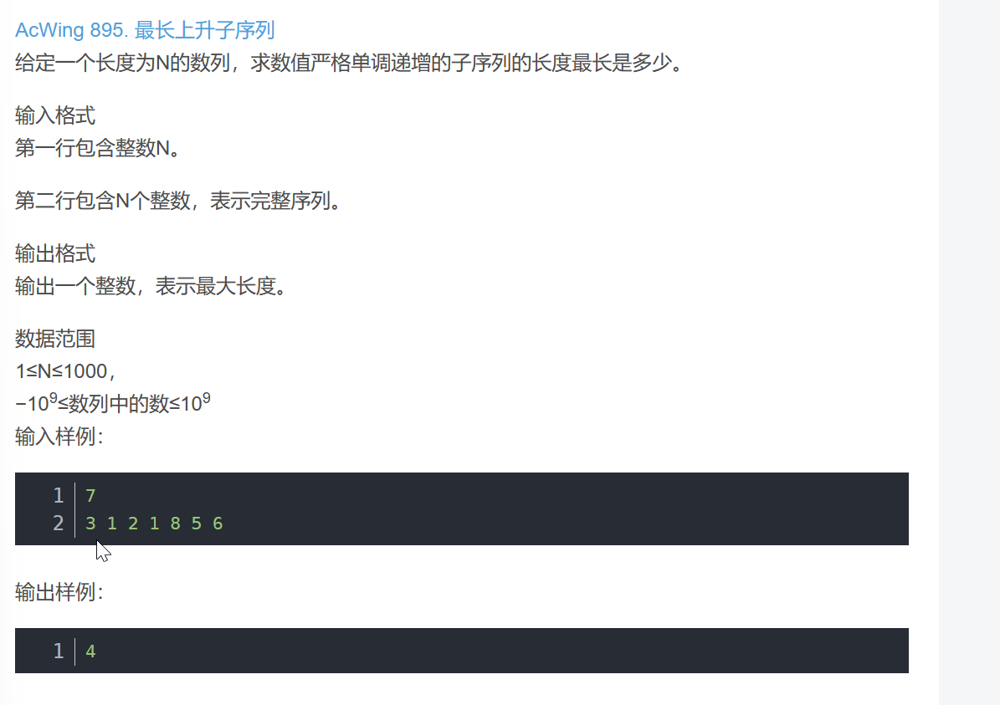

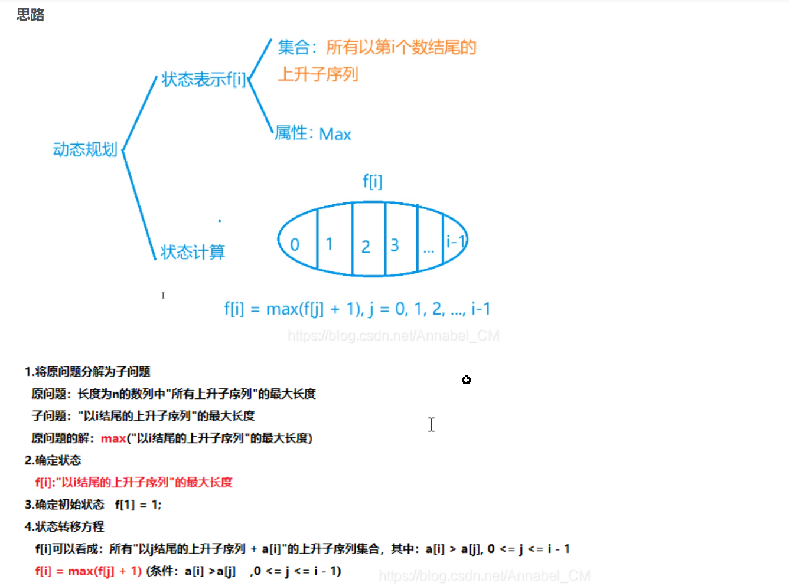

>此处要分析动态规划中的状态表示，f[i]的意义是以第i个为结尾的上升子序列，而我们需要求的属性是MAX，对于f[i]我们可以划分为 以i之前一个数为结尾的上升子序列 + 1，此处需满足条件是a[i] > a[j].
最后需要遍历所有f，来存一个最大值


```
#include <iostream>
#include <algorithm>

using namespace std;

const int N = 1010;

int n;
int a[N], f[N];//f[i]表示所有以i结尾的严格单调上升的子序列的最大长度

int main()
{
    scanf("%d", &n);
    for (int i = 1; i <= n; i ++ ) scanf("%d", &a[i]);

    for (int i = 1; i <= n; i ++ )
    {
        f[i] = 1; // 只有a[i]一个数,每一个f[i]的初始化都是1，因为最短就是本身，即为1；
        for (int j = 1; j < i; j ++ )
            if (a[j] < a[i])//虽然划分包含所有a[i],但其不一定合法，因此需要提前预判一下
                f[i] = max(f[i], f[j] + 1);
    }

    int res = 0; //通过遍历f数组，来求最大值
    for (int i = 1; i <= n; i ++ ) res = max(res, f[i]);

    printf("%d\n", res);

    return 0;
}

// { 3,1,2,1,8,5,6 }
//输出  4
```

### 买卖股票的最佳时机

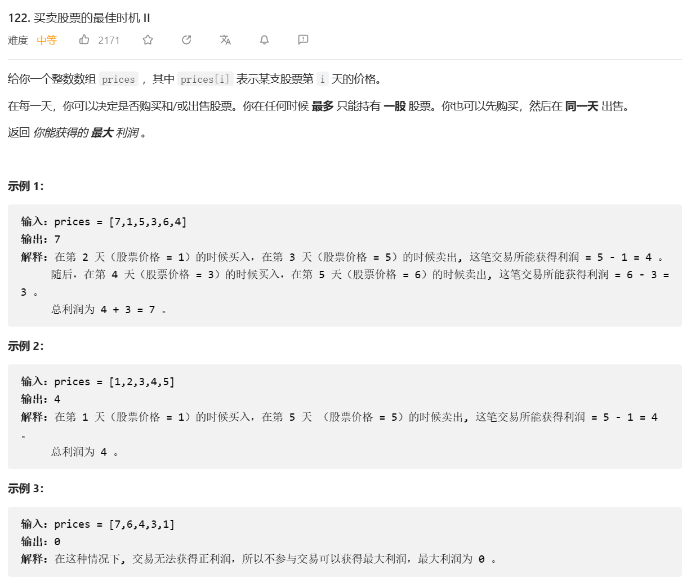

```
class Solution {
    /**
     *  继续上一题思路，继续用转移方程
     *  假设第i天持有股票的收益为f(i,1),未持有的收益为f(i,0)
     *  f(i,1) = max(f(i-1, 1), f(i-1, 0)-prices[i])
     *  f(i,0) = max(f(i-1, 0), f(i-1, 1)+prices[i])
     *  f(0,0) = 0, f(0,1)=-prices[0];
     *  还有一个思路是遍历判断前后两天的收益，是正的就累计
     *  因为不限制交易次数，可以在跌了前卖出，涨之前买入
     *  吃掉所有利差
     */
    public int maxProfit(int[] prices) {
        if(prices.length<2) return 0;
        int i0=0, i1=-prices[0];
        for(int i=0; i<prices.length; i++){
            int j0 = Math.max(i0, i1+prices[i]);
            int j1 = Math.max(i1, i0-prices[i]);
            i0=j0;
            i1=j1;
        }
        return i0;
    }
}
```

```
#include<iostream>
#include<vector>
using namespace std;


int process(vector<int> arr, int i, int t, vector<vector<int>> &recd) {
	if (i < 0) {
		return t ? INT_MIN : 0;
	}
	if (recd[t][i] != -1) return recd[t][i];
	if (t == 1)  //第i天持有股票，即当天买入股票，或者不卖，注意：要买股票的话必须首先是手里没有股票
	{
		int res = max(process(arr, i - 1, 1, recd), process(arr, i - 1, 0, recd) - arr[i]);//第i-1天有股票，保持不变。第i-1天没有股票，在i天买入股票，故需减去买股票的钱
		recd[1][i] = res; 
		return res;
	}
	else  //第i天没有股票，即当天卖出 
	{
 		int res = max(process(arr, i - 1, 0, recd), process(arr, i - 1, 1, recd) + arr[i]);  //第i-1天没有股票，继续保存。或第i-1天有股票，在第i天卖出，故加上卖股票的钱
		recd[0][i] = res;
		return res;
	}
}


int main() { 
	vector<int> arr = { 7,1,5,3,6,4 };
	int l = arr.size();
	vector<vector<int>> recd(2, vector<int>(l, -1));
	cout << process(arr, l - 1, 0, recd)<<endl;
	for (auto i : recd) {
		for (auto j : i) {
			cout << j << " ";
		}
		cout << endl;
	}
	return 0;
}
```

### 21-1 最长回文子串

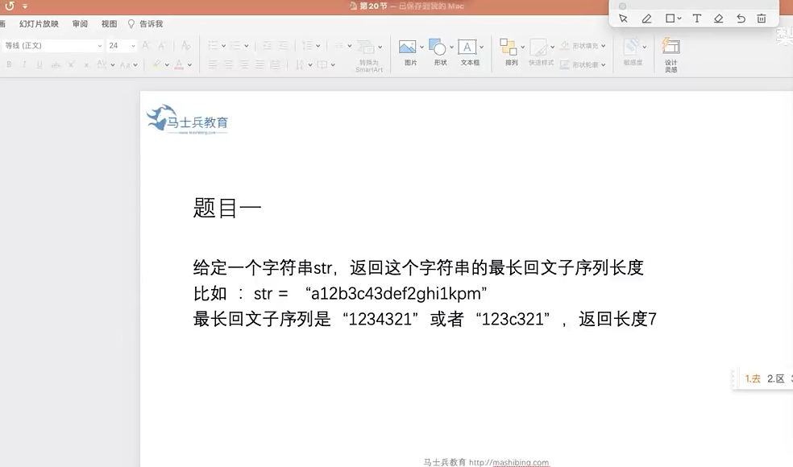

```
int process(char str[],int L,int R){
	if(L==R){
		return 1;
	}
	if(L==R-1){
		return str[L]==str[R]?2:1;
	}

	int p1=process(str,L+1,R-1);
	int p2=process(str,L,R-1);
	int p3=process(str,L+1,R);
	int p4=str[L]!=str[R]?0:(2+process(str,L+1,R-1));
	return max(max(p1,p2),max(p3,p4));
}
```